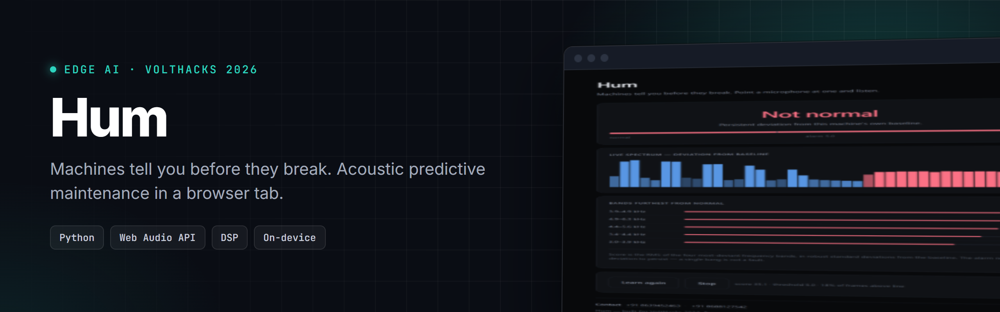
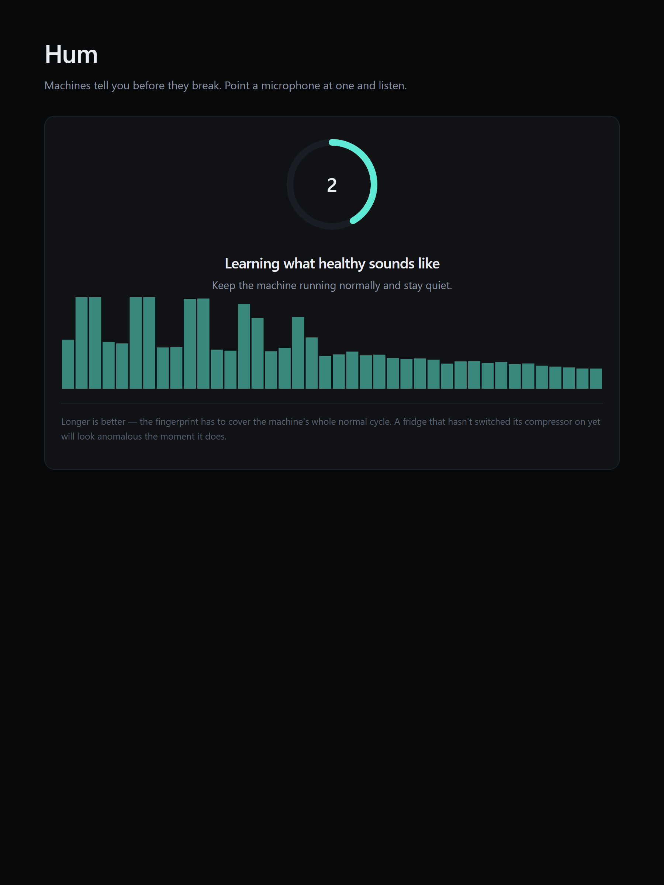
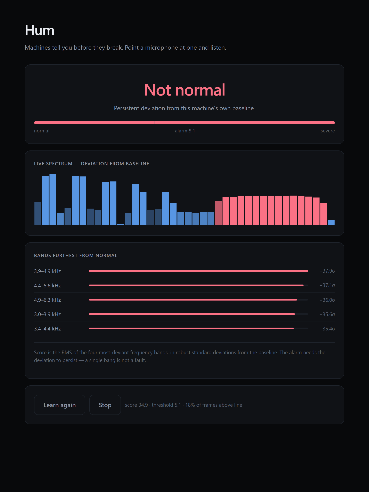

<!-- header:start -->
<p align="center">
  
</p>

<p align="center">
  <a href="https://ramsai676.github.io/hum-acoustic-monitor/"></a>
  
  <a href="LICENSE"></a>
</p>

<p align="center">
  
  
</p>

<!-- header:end -->

**Machines tell you before they break.** Point a microphone at one and listen.

Built for [VoltHacks 2026](https://volthacks.devpost.com/).

---

## What it does

A failing motor sounds different before it stops working. A dry bearing starts
ticking. A worn one adds a broadband hiss. An unbalanced rotor leans harder on
its running frequency. People who maintain machines for a living can hear it.
Most of us cannot, and by the time we can, the machine has stopped.

Hum listens to a machine for 45 seconds, builds a statistical fingerprint of what
that machine sounds like *when it is well*, then watches for the sound drifting
away from that fingerprint — and tells you **which frequencies moved**, not just
that something changed.

It runs entirely in a browser tab. No install, no account, no server. **Audio
never leaves the device**, which is also why it works offline.

```
open web/index.html      →  "Run without a mic" for a scripted demo
                         →  "Start listening" to point it at a real machine
```

---

## Why unsupervised

The obvious approach is to train a classifier on recordings of broken machines.
That approach dies on contact with reality: nobody has labelled recordings of
*your* fridge failing, the public industrial datasets are tens of gigabytes and
cover machines you do not own, and a model trained on someone else's pump does
not transfer to your washing machine.

So Hum never learns what "broken" sounds like. It learns what **this machine, in
this room** sounds like right now, and flags departure. That means it works on
the first machine you point it at, with no training data at all.

---

## Does it actually work?

`python validate.py` scores the detector against four physically-grounded
failure modes and — just as importantly — three ways a *healthy* machine gets
recorded badly.

```
FAULT DETECTION            AUC     score range   detected
  bearing @1x            1.000       14.9-16.1      100%
  bearing @0.5x          1.000         8.3-9.2      100%
  bearing @0.25x         0.964         4.2-5.0        0%   (not required)
  friction @1x           1.000       34.4-35.9      100%
  friction @0.5x         1.000       25.7-27.3      100%
  friction @0.25x        1.000       16.9-18.4      100%
  imbalance @1x          1.000        8.6-10.4      100%
  imbalance @0.5x        1.000         5.1-6.3      100%
  imbalance @0.25x       0.774         3.0-4.5        0%   (not required)
  looseness @1x          1.000       17.8-18.5      100%
  looseness @0.5x        1.000       14.0-14.7      100%
  looseness @0.25x       1.000       10.2-10.9      100%

FALSE ALARMS (healthy machine, bad recording)  score range     alarms
  plain healthy                                   1.8-4.1        0%
  mic moved (+6 dB)                               1.8-4.1        0%
  speech nearby                                   2.0-4.6        0%
  door slam                                       1.8-4.2        0%
```

**Detection limit, stated plainly:** at quarter severity, friction and looseness
are still caught every time, but bearing and imbalance fall *inside* the healthy
score range and are missed. That is a real boundary, not a tuning failure — at
that level the signal is genuinely inside the noise.

The fault models follow standard vibration-analysis signatures: bearing wear as a
periodic train of decaying impulses exciting a resonance, friction as a broadband
rise weighted to 1.5–6 kHz, imbalance as a rise in the 1× running component,
looseness as sidebands at ± shaft speed. See `hum/signals.py`.

---

## How it works

```
audio ─→ 256 ms frames ─→ FFT ─→ 40 bands ─→ log ─→ subtract frame mean
                                                            │
                     baseline: per-band median + MAD ←───────┤
                                                            ▼
                        robust z-score per band ─→ RMS of top 4 ─→ smooth ─→ compare
```

Four decisions carry most of the weight, and each one was forced by a measured
failure rather than chosen up front:

**Gain invariance.** Each frame has its own mean subtracted, so only spectral
*shape* survives. Without it, moving the phone 20 cm closer raises every band
equally and reads as a catastrophic fault — measured at a **100% false-alarm
rate**. The cost is honest: a fault whose only symptom is uniform loudness is now
invisible.

**Persistence, not peaks.** The alarm gates on the *median* frame score across a
clip. Scoring a high percentile meant anything covering 10% of the clip tripped
it, giving **100% false alarms on nearby speech**. Machine faults are continuous;
people talking are not. This costs sensitivity to genuinely intermittent faults.

**Linear bands below 500 Hz, log above.** Not mel. Mel spacing is tuned to human
speech perception and treats everything under 500 Hz as roughly one lump —
which is precisely where machines live. Measured with mel bands, rotor imbalance
scored **AUC 0.63 and was never detected**.

**Robust statistics throughout.** Median and MAD rather than mean and standard
deviation, because the baseline is captured in a real room. A cough during those
45 seconds must not widen the band and blind the detector for the rest of the
session.

**Top-4 rather than all-40 bands.** A real fault moves a handful of bands hard.
Averaging across all 40 dilutes exactly the signal being looked for.

### Interpretability

The score alone would be useless in the field. Hum reports the bands furthest
from normal, in robust standard deviations:

```
2703-3440 Hz   louder   z=+20.44
3050-3881 Hz   louder   z=+18.90
2396-3050 Hz   louder   z=+7.73
```

That is the validator correctly recovering the 3.2 kHz resonance that the
synthetic bearing fault excites. A maintenance engineer can act on "energy rose
at 3 kHz". Nobody acts on "reconstruction error 0.83".

---

## Layout

```
web/index.html     the product — Web Audio, on-device, no dependencies
hum/detector.py    reference implementation (the browser mirrors it exactly)
hum/signals.py     fault + nuisance models used for validation
validate.py        the numbers above
```

The browser and Python implementations are deliberately kept in step: same band
edges, same gain invariance, same top-k statistic, same threshold rule. Python is
where the algorithm is validated; the browser is where it ships.

---

## Cost

**Zero.** No hardware, no API keys, no cloud services, no accounts. The sensor is
a microphone you already own, and the inference is arithmetic in a browser tab.

---

## Honest limitations

- **Validated on synthetic faults, not recorded ones.** The signal models follow
  established vibration-analysis signatures, but synthetic audio is kinder than a
  real workshop. Real recordings are the obvious next step.
- **The baseline must cover a full duty cycle.** A fridge whose compressor has not
  kicked in during those 45 seconds will look anomalous the moment it does.
- **No severity trend.** It reports current deviation, not whether it is getting
  worse over days — which is what actually predicts a failure date.
- **Quiet or distant machines.** If the machine is near the room noise floor,
  there is no signal to fingerprint.
- **One machine at a time.** Two machines in earshot are learned as one, and
  either changing triggers the alarm.

## License

MIT — see [LICENSE](LICENSE).
